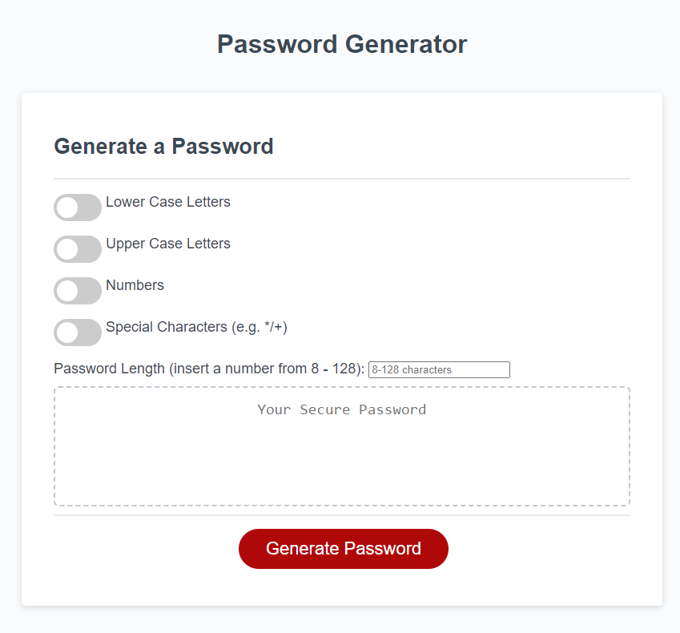
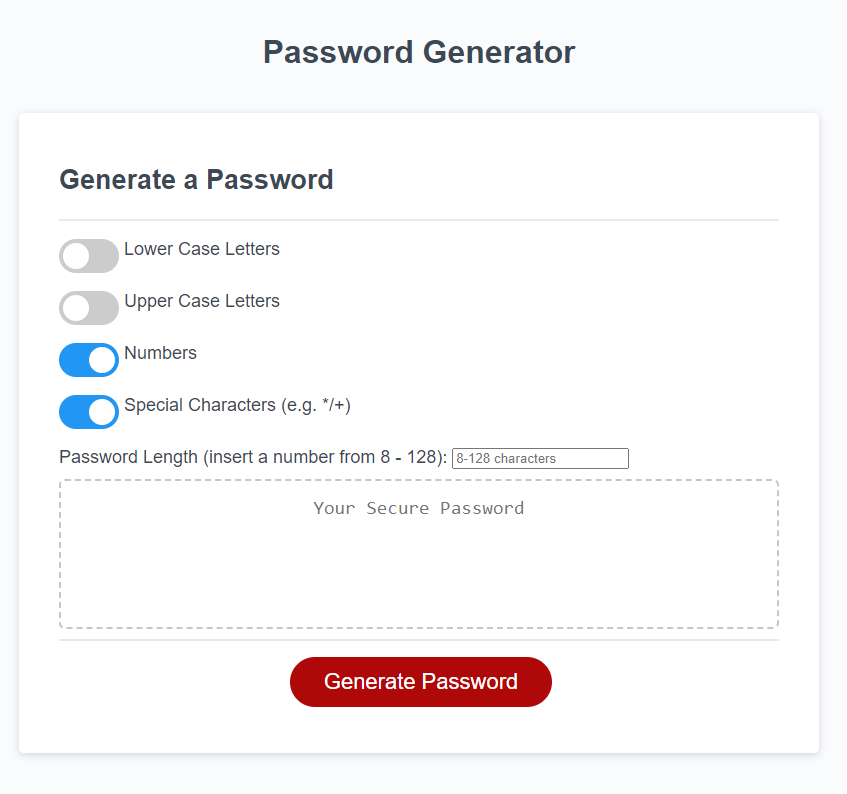
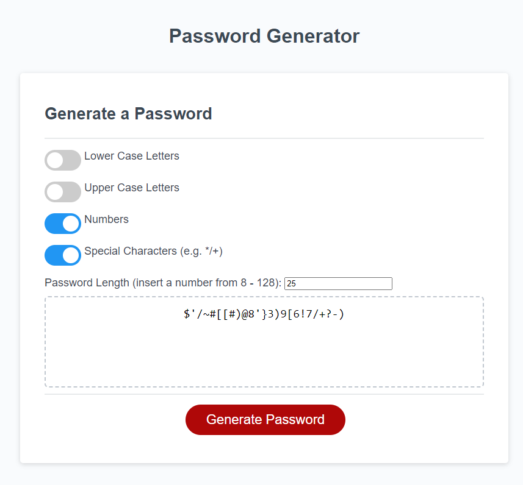
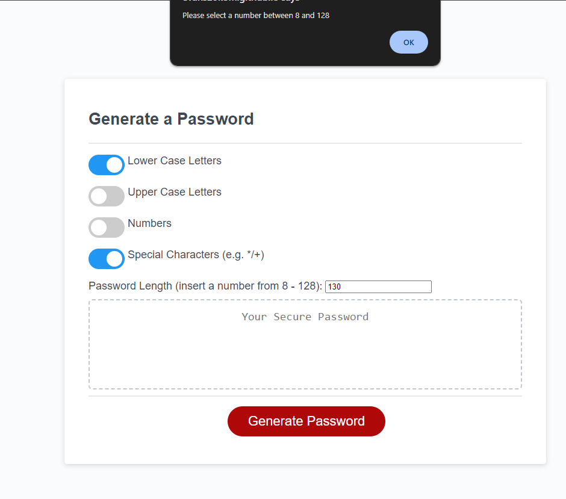

# *** EDIT BEFORE SUBMITTING ***
# Password Manager - Github Repo password-manager https...
# *** EDIT BEFORE SUBMITTING ***

## Description

A simple password manager application using html, css, and javascript, that takes user input and generates a pseudo-random string of characters that the end user can use as a password.

# *** EDIT BEFORE SUBMITTING ***
This application aims to emulate a real world application that receives input in the format of a 2-dimensional array and produces output that is meaningful to the end user (e.g. numerical data and information)

I engaged with this project as it was an opportunity to identify ways to mathematically manipulate array data and present them in a functional way for the end user.

While building this application, I have learnt about two-dimensional arrays and how to call on information from them, how javascript processes mathematical functions, and how to troubleshoot when the application does not behave as expected, by changing elements to identify which part of the application is responsible for the unpredictable output.

# *** EDIT BEFORE SUBMITTING ***

## Table of Contents (Optional)

You can find the deployed application [here](https://evans20kom.github.io/password-manager/): https://evans20kom.github.io/password-manager/

You can find the github repo [here](https://github.com/Evans20kom/password-manager): https://github.com/Evans20kom/password-manager

## Installation

N/A

## Usage

When you open the deployed application [here](https://evans20kom.github.io/password-manager/), 

# *** EDIT BEFORE SUBMITTING ***

a blank page will appear that prompts you to look in the console window:
    

    

Right click on the page and click "inspect". Alternatively, press F12 on your keyboard.
    
    

    
On the right hand side, you will see a new window. Find the tab that writes "console" at the top, and click on it.
    
    

    
You can see the output of the application on the console window on your right, under the console tab.
    
    

# *** EDIT BEFORE SUBMITTING ***

## Credits

A number of sources were used for the development of this application:

<ul>
<li>Chris H - Central Grader: On the challenge for week 3, they alerted me to the fact that the presentation of my README file is not the expected one; upon investigating, I realized that markdown syntax was not correct</li>
<li>CG Collin - Central Grader: After grading the challenge for week 4, they confirmed that the corrections I made to the README file were acceptable; based on this feedback, I maintained the previous REAME file structure as a template for future projects.</li>
<li>Source for toggle switch for user input - html and css sourced from w3schools:
https://www.w3schools.com/howto/howto_css_switch.asp</li>
<li>Looked for code for an input box here:
https://www.w3schools.com/html/html_form_input_types.asp</li>
<li>Found an approach to read html values of a toggle switch here:
https://stackoverflow.com/questions/11599666/get-the-value-of-checked-checkbox and here: https://www.javatpoint.com/how-to-get-all-checked-checkbox-value-in-javascript</li>
<li>Attempt 2 at testing toggles, found the approach here:
https://www.youtube.com/watch?v=TjpL8U_vxOo and studied further here:  <ul><li>https://developer.mozilla.org/en-US/docs/Web/API/Document/querySelector</li><li>https://developer.mozilla.org/en-US/docs/Web/API/Event/preventDefault</li><li>https://www.w3schools.com/jsref/met_element_addeventlistener.asp</li>
</li>

# *** EDIT BEFORE SUBMITTING ***

<li>Looked for details on two dimensional arrays and code here:
https://www.freecodecamp.org/news/javascript-2d-arrays/</li>

<li>Found how to add within an array here:
https://www.freecodecamp.org/news/how-to-add-numbers-in-javascript-arrays/</li>

<li>Found how to subtract negative numbers here:
https://stackoverflow.com/questions/27589902/addition-and-subtraction-with-negative-numbers</li>

<li>Found how to convert number to string here:
https://www.digitalocean.com/community/tutorials/how-to-convert-data-types-in-javascript#converting-values-to-strings</li>

<li>Found how to round to two decimal points here:
https://codedamn.com/news/javascript/javascript-round-a-number-to-2-decimal-places-with-examples</li>

</ul>
# *** EDIT BEFORE SUBMITTING ***

## License

MIT License

## Badges

N/A

## Features

N/A

## How to Contribute

N/A

## Tests

TBA
